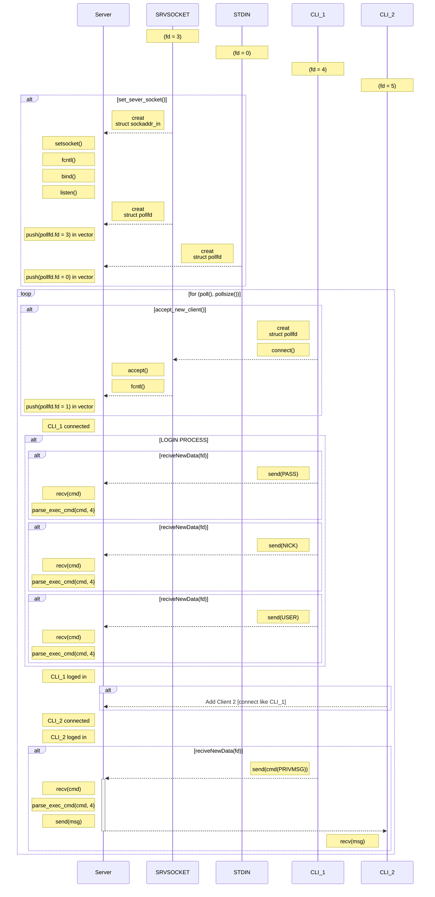

<!--
external links testet on 27.03.2025

https://www.rfc-editor.org/rfc/rfc1459.html
https://medium.com/@afatir.ahmedfatir/small-irc-server-ft-irc-42-network-7cee848de6f9
-->

# ft_irc

ft_irc is a project developed as part of the curriculum at 42 school. It is an implementation of an Internet Relay Chat (IRC) server and client using the C++ programming language. IRC is a protocol for real-time messaging and communication in a distributed network environment. The fundamental architecture, commands, and message formats for communication in an IRC network are described in [RFC 1459](https://www.rfc-editor.org/rfc/rfc1459.html). The core standards of this RFC have been incorporated into this program and function accordingly.

## Features
- Multi-threaded architecture for handling concurrent client connections.
- Support for multiple simultaneous connections.
- Creation and management of IRC channels.
- User authentication and registration.
- Broadcasting messages to all users in a channel.
- Private messaging between users.
- Handling of various IRC commands such as JOIN, PRIVMSG, PART, etc.
- Support for user nicknames and channel names.
- Connect to the IRC server.
- Join channels and participate in group conversations.
- Send and receive messages.
- Change user nickname.
- Send private messages to other users.

## Learning 

Importante function [poll()](_doc/lib/poll().md) and [socket](/_doc/lib/<socket.h>.md). 

Also have a [lock](_doc/lib/overview.md)



## Installation
``` bash
git clone https://github.com/ELREKO/chatserver_irc_standard.git irc_server
cd irc_server
make
```
## Usage
``` bash
./ircserv <port number> <password>
```
So at this point, the server is running. It just needs to be connected to. You can use any IRC client or simply use the nc (NetCut) tool like this:
```bash
nc localhost <port number>
```
After that, authenticate your client using the following commands:
```bash
pass <password>
nick <nickname>
user <username> #it should be 4 arguments
```

## Usage example
#### Run this cmd in the terminal
```bash
./ircserv 4444 hello
```
#### in another terminal run
```bash
nc localhost 4444
```
#### and then pass the following commands
```bash
pass hello
nick afatir
user afatir 0 * afatir
```
### and for the bot it connects automatically to the server
```bash
./bot localhost 4444 hello bot BONUS/qoutes
```

 For a full explanation of the IRC Server, you can check out on [Medium blog](https://medium.com/@afatir.ahmedfatir/small-irc-server-ft-irc-42-network-7cee848de6f9) for the complete details.
